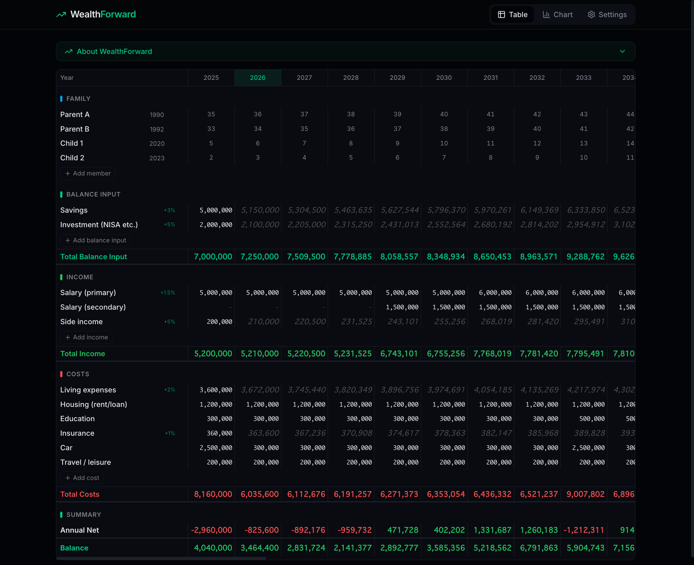
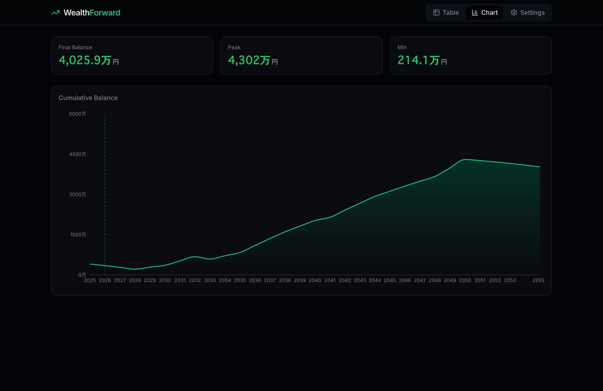
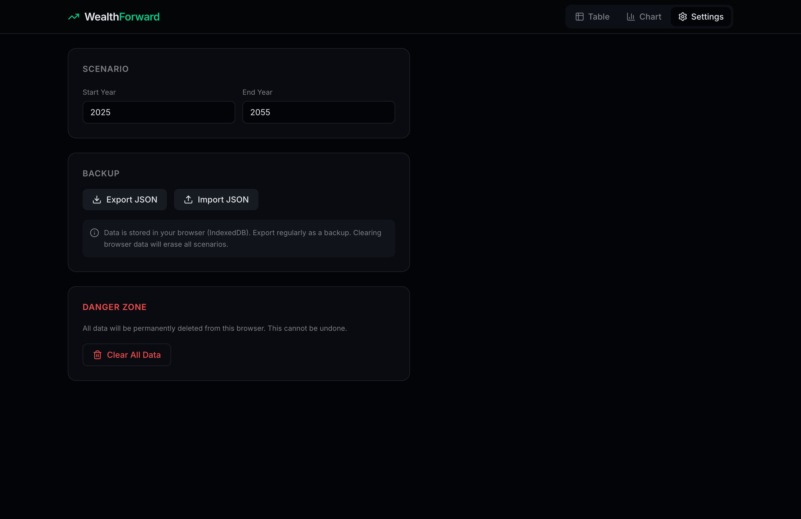

# WealthForward

A free, browser-only life simulation tool. Enter your family, income, expenses, and savings to project your net worth over the next 50 years.

**No sign-up. No server. Your data stays in your browser.**

> Live demo: [wf.solocamp.work](https://wf.solocamp.work)



## Features

- **Spreadsheet-style input** - Edit yearly income, expenses, and savings in a familiar grid interface
- **Growth rate per category** - Set annual % growth rates to auto-fill future years (e.g. +2% inflation on living expenses)
- **Family age tracking** - Add family members with birth years; ages are displayed across all years
- **Balance inputs with carry-forward** - Define savings/investment levels that carry forward and compound with growth rates
- **Interactive charts** - Visualize income, expenses, and cumulative balance over your simulation period
- **JSON backup & restore** - Export your scenarios as JSON files, import them anytime
- **One-click data clear** - Wipe all data instantly when you're done
- **Dark theme** - Easy on the eyes, optimized for focused financial planning



## Tech Stack

| Layer | Technology |
|-------|-----------|
| Framework | React 19 + TypeScript |
| Build | Vite 8 |
| Styling | Tailwind CSS v4 |
| Animations | Framer Motion |
| Charts | Recharts |
| Storage | IndexedDB (via Dexie.js) |
| Hosting | Cloudflare Pages |

## Privacy & Security

- **Zero backend** - Pure client-side SPA. No API calls, no analytics, no tracking
- **IndexedDB storage** - All data is stored locally in your browser's IndexedDB
- **CSP headers** - Content Security Policy, X-Frame-Options, and other security headers configured
- **Import validation** - JSON imports are fully validated to prevent malformed data
- **No cookies** - No authentication, no sessions, no cookies

## Getting Started

### Prerequisites

- Node.js 20+
- npm

### Development

```bash
git clone https://github.com/mizumotter/WealthForward.git
cd WealthForward
npm install
npm run dev
```

Open [http://localhost:5173](http://localhost:5173) in your browser.

### Build

```bash
npm run build
```

Output is in `dist/`, ready to deploy to any static hosting (Cloudflare Pages, Vercel, Netlify, etc.).

## How It Works

1. **Table tab** - Input your family members, savings, income sources, and expense categories year by year
2. **Growth rates** - Hover over a category label to set an annual growth rate (e.g. +3% on savings, +2% on living costs)
3. **Chart tab** - View the projected income, expenses, and cumulative balance as an area chart
4. **Settings tab** - Adjust simulation period (start/end year), export/import backups, or clear all data

### Simulation Engine

- **Income & Costs**: Flow-based. Each year is independent (or auto-filled via growth rate)
- **Balance Inputs**: Carry-forward mode. A value persists until explicitly changed, compounding with the growth rate
- **Annual Net** = Total Income - Total Costs
- **Cumulative Balance** = Running sum of Annual Net + Balance Input level

## Screenshots

| Table | Chart | Settings |
|-------|-------|----------|
|  |  |  |

## License

MIT
